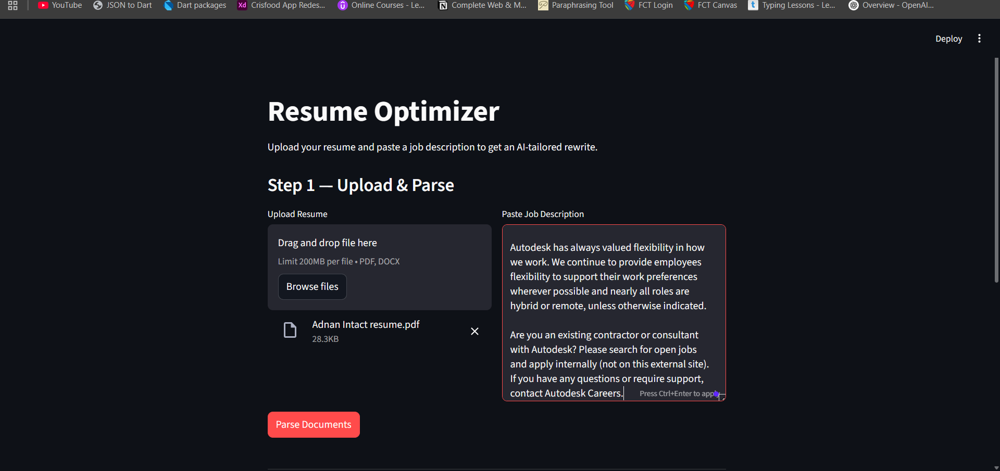
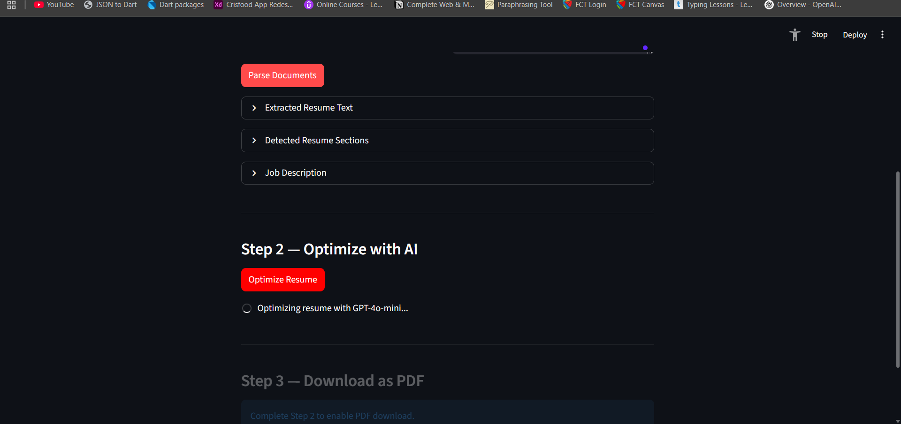
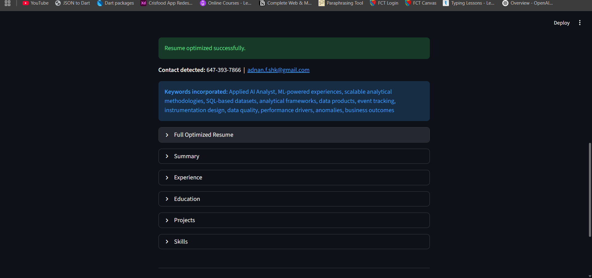
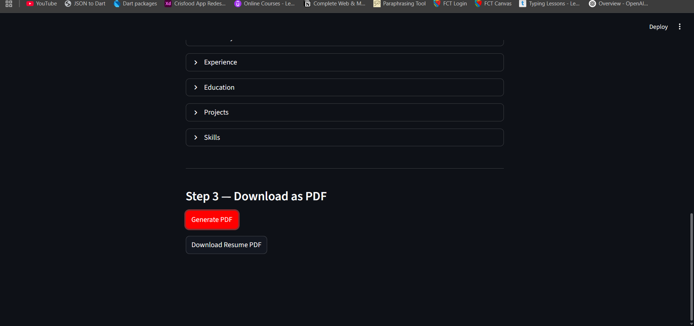

# Resume Optimizer

An AI-powered resume rewriter built with **Streamlit** and **GPT-4o-mini**. Upload your resume, paste a job description, and get a tailored, ATS-optimised resume exported as a clean PDF — in seconds.

  

---

## Screenshots

| Step 1 — Upload & Parse | Step 2 — Optimizing |
|---|---|
|  |  |

| Step 2 — Result | Step 3 — Download PDF |
|---|---|
|  |  |

---

## Features

- **PDF & DOCX support** — upload any text-based resume
- **ATS optimisation** — keywords from the job description are woven into your resume
- **Smart summary** — leads with your strongest professional identity, framed for the target role
- **Structured skills** — all technical skills grouped into labelled categories
- **Clean PDF export** — professional A4 layout with navy headers, generated via wkhtmltopdf

---

## How It Works

```
Upload Resume (PDF/DOCX)  +  Paste Job Description
                ↓
        Parse & detect sections
                ↓
     GPT-4o-mini rewrites resume
     (10-rule system prompt, JSON output)
                ↓
     Jinja2 renders HTML template
                ↓
     pdfkit → downloadable PDF
```

**3 steps in the UI:**
1. **Upload & Parse** — extracts raw text and detects sections (Summary, Experience, Education, Projects, Skills)
2. **Optimize with AI** — rewrites the resume to match the job description; shows keywords added
3. **Download as PDF** — generates and downloads a styled A4 PDF

---

## Project Structure

```
resume-optimizer/
├── .env                          # OPENAI_API_KEY (not committed)
├── requirements.txt
└── app/
    ├── main.py                   # Streamlit UI
    ├── parser/
    │   ├── pdf_extractor.py      # PyMuPDF text extraction
    │   ├── docx_extractor.py     # python-docx text extraction
    │   ├── resume_parser.py      # Dispatcher + ResumeData TypedDict
    │   └── section_detector.py   # Splits text into named sections
    ├── llm/
    │   └── optimizer.py          # System prompt + OpenAI API call
    └── pdf/
        ├── generator.py          # Jinja2 render + pdfkit conversion
        └── templates/
            └── resume.html       # ATS-compliant HTML resume template
```

---

## Setup

### 1. Clone the repo

```bash
git clone https://github.com/DevAdnan55/resume-optimizer.git
cd resume-optimizer
```

### 2. Install Python dependencies

```bash
pip install -r requirements.txt
```

### 3. Install wkhtmltopdf

Required for PDF generation.

- **Windows:** Download from [wkhtmltopdf.org/downloads.html](https://wkhtmltopdf.org/downloads.html) and install to `C:\Program Files\wkhtmltopdf\`
- **macOS:** `brew install wkhtmltopdf`
- **Linux:** `sudo apt-get install wkhtmltopdf`

### 4. Add your OpenAI API key

Create a `.env` file in the project root:

```
OPENAI_API_KEY=sk-...
```

### 5. Run

```bash
streamlit run app/main.py
```

---

## Tech Stack

| Library | Version | Purpose |
|---|---|---|
| streamlit | 1.55 | Web UI |
| openai | 1.109 | GPT-4o-mini API |
| PyMuPDF | 1.27 | PDF text extraction |
| python-docx | 1.2 | DOCX text extraction |
| Jinja2 | 3.1 | HTML resume template |
| pdfkit | 1.0 | HTML → PDF via wkhtmltopdf |
| python-dotenv | 1.1 | Load `.env` config |

---

## Notes

- **Scanned PDFs are not supported** — the resume must be a text-based PDF
- Your `.env` file is gitignored and never committed
- The LLM is instructed never to fabricate jobs, dates, skills, or contact details
